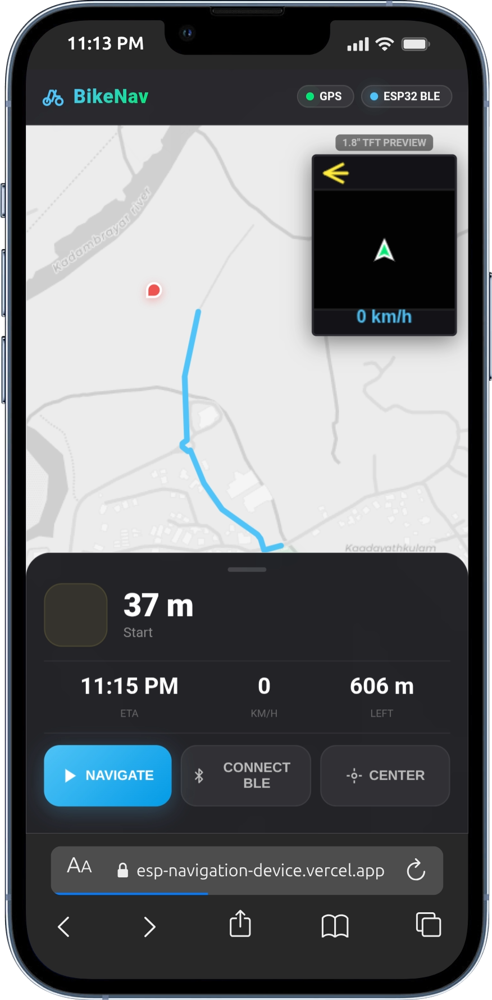
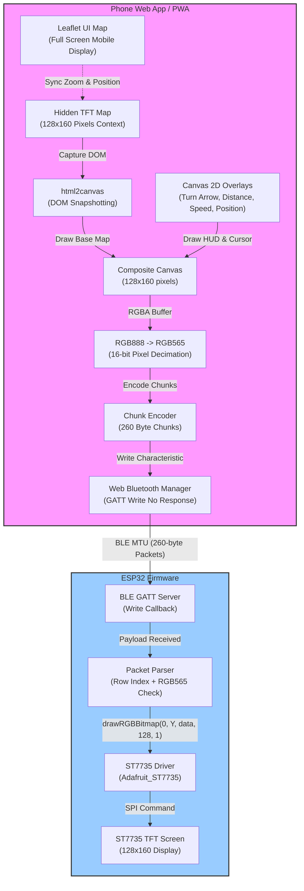

# BikeNav — ESP32 BLE TFT Navigation System

An ultra-efficient, low-bandwidth navigation system that streams high-fidelity maps and real-time turn-by-turn routing from a mobile browser directly to an ESP32 micro-device driving an ST7735 TFT display over Bluetooth Low Energy (BLE).

---

## 🌟 Key Features

- **Dual-Map Hybrid Architecture**: Features a high-resolution, full-screen interactive Mapbox/Leaflet UI on the mobile phone, combined with a hidden, synchronized micro-map (128x160) for TFT projection.
- **Micro-Streaming Engine**: Dynamically captures map frames, composites sharp vector navigation overlays (turn directions, remaining distance, current speed), and decimates color depth from 32-bit RGBA down to 16-bit RGB565 in real time.
- **BLE MTU Optimization**: Streams pixel data in row-based chunks of 260 bytes (1 row = 128 pixels * 2 bytes + 4-byte padding/header), ensuring data fits perfectly within standard BLE MTU packet limits without fragmentation overhead.
- **Zero-Latency Hardware Processing**: Receives raw RGB565 rows and paints them immediately to the ST7735 TFT using hardware SPI, achieving smooth frame rates over low-power BLE without any decompression/decompilation overhead on the ESP32.
- **Progressive Web App (PWA)**: Fully offline-capable, responsive, and mobile-optimized application with standard service worker caching and manifest definitions.

---

## 📸 System Previews

Here is a view of the BikeNav hardware display in action alongside the Web UI dashboard:

| Hardware Device on Bike Handle | PWA Mobile UI on iPhone 13 Pro |
|:---:|:---:|
|  |  |

---

## 🛠️ Technical Stack

### Hardware Layer
- **Microcontroller**: ESP32 (acting as BLE GATT Server & SPI Master)
- **Display**: ST7735 1.8" Color TFT LCD (128x160 pixels, 16-bit color)
- **Libraries**: `Adafruit_GFX`, `Adafruit_ST7735`, standard `ESP32 BLE` library
- **Interface Protocol**: High-speed Hardware SPI (Clock rate up to 24MHz)

### Software & Web Layer
- **Core Environment**: Vanilla WebGL/HTML5, CSS3 (glassmorphism/dark mode system), and ES6 Javascript
- **Map Renderer**: Leaflet.js (Map rendering with CartoDB Dark Matter tiles)
- **Routing Engine**: OSRM (Open Source Routing Machine) API with dual-profile fallback (Cycling & Driving)
- **DOM Capturer**: `html2canvas` for DOM-to-canvas rendering and image buffer extraction
- **Protocol**: Web Bluetooth API (GATT Service & Characteristic stream)

---

## ⚡ Hardware Wiring Diagram

Connect the ST7735 TFT display to the ESP32 using the following high-speed hardware SPI pins:

| ST7735 Pin | Description | ESP32 GPIO |
|:---|:---|:---|
| **VCC** | Power Supply (3.3V / 5V) | `3V3` |
| **GND** | Ground | `GND` |
| **CS** | Chip Select | `GPIO 5` |
| **RST** | Reset | `GPIO 4` |
| **DC/A0** | Data/Command Select | `GPIO 2` |
| **SDA/MOSI** | SPI Master Out Slave In | `GPIO 23` |
| **SCK/SCLK** | SPI Clock | `GPIO 18` |
| **LED** | Backlight Control | `3V3` (through a 220Ω resistor) |

---

## 📐 Architecture & Protocol Deep Dive



### 1. Dual-Map Pattern
To overcome the rendering limitation of small physical displays and mobile-device constraints, the system operates **two distinct instances** of Leaflet maps simultaneously:
- **Phone Map (`#uiMap`)**: Set to `zoom: 16` with interactive panning and routing UI controls.
- **TFT Map (`#tftMap`)**: Hidden in a `0x0` container, set to `zoom: 17` (slightly zoomed in to give maximum contrast to road names and intersections on the small screen). It locks position matching the current location.

### 2. High-Definition Vector Compositing
Directly rendering HTML/CSS tags onto the tiny canvas using `html2canvas` results in fuzzy, low-contrast text. To address this, the system captures *only* the geographic map tiles from the hidden map. It then composites the UI layout directly on the canvas using native vector drawing:
- **Top HUD Bar**: Rendered as a dark gray translucent bar (`rgba(20, 20, 26, 0.9)`) with a white 15px sans-serif distance text and precise SVG-like vector turn arrows (LEFT, RIGHT, STRAIGHT, UTURN).
- **Bottom Speed Bar**: Renders speed in blue (`#4FC3F7`) at 16px bold typography.
- **Center Bike Cursor**: A sharp vector triangle filled with vibrant lime-green (`#00E676`) and outlined in white, which rotates according to the device's magnetic/GPS heading degrees.

### 3. RGB888 to RGB565 Color Decimation
Standard HTML5 canvas outputs pixel color channels as 32-bit RGBA (8 bits per channel: Red, Green, Blue, Alpha). The ST7735 TFT display uses 16-bit RGB565 color representation. The web app scales down each color channel before transmission:
```javascript
// Extract RGB888 channel components
const r = rgbaData[rgbaIdx];
const g = rgbaData[rgbaIdx + 1];
const b = rgbaData[rgbaIdx + 2];

// Downsample: Red (5 bits), Green (6 bits), Blue (5 bits)
const rgb565 = ((r & 0xF8) << 8) | ((g & 0xFC) << 3) | (b >> 3);
```

### 4. Custom Streaming Chunk Protocol
To guarantee reliable delivery within typical BLE maximum transmission unit (MTU) packet sizes without triggering link-layer fragmentation (which causes high packet loss and latency), each frame is streamed row-by-row in **260-byte chunks**:

$$\text{Packet Size} = \underbrace{\text{Row Index}}_{\text{1 Byte}} + \underbrace{\text{Padding for 32-bit alignment}}_{\text{3 Bytes}} + \underbrace{128 \text{ Pixels} \times 2 \text{ Bytes}}_{\text{256 Bytes}} = 260 \text{ Bytes}$$

- **Little-Endian Byte Order**: The pixel bytes are stored as `buffer[4 + i*2] = rgb565 & 0xFF` (Low byte) and `buffer[4 + i*2 + 1] = rgb565 >> 8` (High byte). This matches the native memory alignment of the ESP32 CPU, preventing expensive byte-swapping operations on the microcontroller.
- **BLE Write Without Response**: Leverages GATT characterisic `PROPERTY_WRITE_NR` which bypasses round-trip confirmation, achieving high-throughput 2 Hz updates over standard Bluetooth link layers.

---

## 🚀 Getting Started

### 1. Hardware Firmware Setup (ESP32)

1. Open the Arduino IDE (or VS Code with PlatformIO).
2. Install the following libraries via the Library Manager:
   - **Adafruit GFX Library**
   - **Adafruit ST7735 and ST7889 Library**
3. Open `bikenav_esp32_ble.ino` in your editor.
4. Select your ESP32 board (e.g. `ESP32 Dev Module`) and compile/upload the sketch.
5. Open the Serial Monitor at `115200` baud. You should see:
   ```text
   Starting ESP32 BLE Navigation Device...
   BLE Advertising started. Device name: BikeNav-ESP32
   ```
6. The display will show the green **BikeNav** boot splash screen with a yellow center dial and "Waiting for app..." banner.

### 2. Frontend Development Setup

No complex build setups or bundlers are required! The web application runs entirely on static assets:

1. Clone or download this project catalog to your local workspace:
   ```bash
   git clone https://github.com/ananthakrishnan754/ESP-NAVIGATION-DEVICE.git
   cd ESP-NAVIGATION-DEVICE
   ```
2. Launch a local web server (Web Bluetooth requires either an `https://` protocol or `localhost` access to comply with browser security rules):
   ```bash
   # Python 3
   python3 -m http.server 8080
   ```
3. Open your browser and navigate to `http://localhost:8080`.

---

## 🚴 How to Use

1. Turn on the **BikeNav ESP32** device.
2. Open the PWA on your smartphone. Allow access to your device's **GPS Location** services.
3. Click the **Connect BLE** button in the bottom panel. A browser Bluetooth prompt will appear.
4. Select **BikeNav-ESP32** from the list and pair. Once connected:
   - The status chip on the top bar changes to **ESP32 BLE Active** (green).
   - The ESP32 device will clear the splash screen and start streaming the active map canvas.
5. Tap anywhere on the map UI on your phone to set a destination.
6. A route will be generated. The remaining distance, ETA, and turn direction indicators will sync.
7. Click the **Navigate** button to start route-tracking. The ESP32 screen will continuously refresh the viewport centered around your position, with rotation matched to your travel direction, updating navigation stats at 2 Hz!

---

## 💡 Troubleshooting

### Web Bluetooth Connection Failures
- **HTTPS Restriction**: Ensure you are serving the app over `https://` or `localhost`. Browsers block Web Bluetooth APIs on raw HTTP sites for security.
- **Android/iOS Permissions**: Ensure Bluetooth is toggled **ON** in your system settings, and that your web browser has permission to access Bluetooth.
- **Chrome Flag**: On some desktop browsers, you may need to enable experimental platform features at `chrome://flags/#enable-experimental-web-platform-features`.

### Display Artifacts or Tearing
- **SPI Cable Quality**: Make sure your jumper wires connecting the ST7735 TFT and the ESP32 are short and secure. High-frequency SPI clocks (20MHz+) suffer from data distortion on long or loose wiring.
- **BLE Connection Interruption**: If the map does not refresh on the screen, restart Bluetooth on the phone and reconnect the BLE session using the button.

---

## 📄 License
This project is open-source and licensed under the MIT License. Feel free to clone, modify, and build your own hardware navigation extensions!
